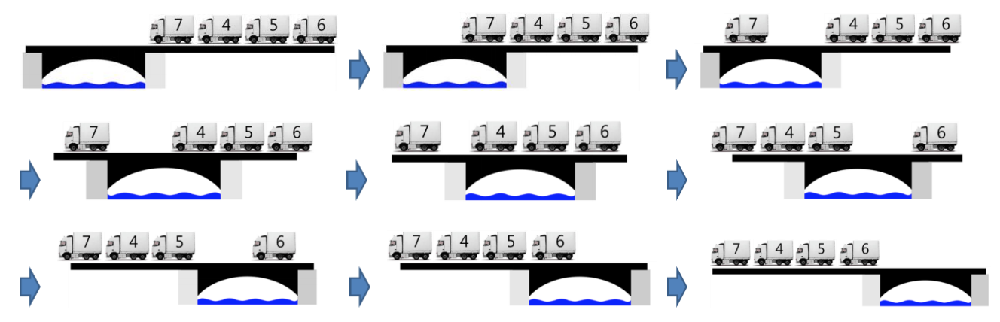

# Python

## baek 14621 나만 안되는 연애 골드3

https://www.acmicpc.net/problem/14621


> python3 188ms
>
> pypy3 148ms


* 문제

  > 깽미는 24살 모태솔로이다. 깽미는 대마법사가 될 순 없다며 자신의 프로그래밍 능력을 이용하여 미팅 어플리케이션을 만들기로 결심했다. 미팅 앱은 대학생을 타겟으로 만들어졌으며 대학교간의 도로 데이터를 수집하여 만들었다.
  >
  > 이 앱은 사용자들을 위해 사심 경로를 제공한다. 이 경로는 3가지 특징을 가지고 있다.
  >
  > 1. 사심 경로는 사용자들의 사심을 만족시키기 위해 남초 대학교와 여초 대학교들을 연결하는 도로로만 이루어져 있다.
  > 2. 사용자들이 다양한 사람과 미팅할 수 있도록 어떤 대학교에서든 모든 대학교로 이동이 가능한 경로이다.
  > 3. 시간을 낭비하지 않고 미팅할 수 있도록 이 경로의 길이는 최단 거리가 되어야 한다.
  >
  > 만약 도로 데이터가 만약 왼쪽의 그림과 같다면, 오른쪽 그림의 보라색 선과 같이 경로를 구성하면 위의 3가지 조건을 만족하는 경로를 만들 수 있다.
  >
  > 
  >
  > 이때, 주어지는 거리 데이터를 이용하여 사심 경로의 길이를 구해보자.

* 입력

  > 입력의 첫째 줄에 학교의 수 N와 학교를 연결하는 도로의 개수 M이 주어진다. (2 ≤ N ≤ 1,000) (1 ≤ M ≤ 10,000)
  >
  > 둘째 줄에 각 학교가 남초 대학교라면 M, 여초 대학교라면 W이 주어진다.
  >
  > 다음 M개의 줄에 u v d가 주어지며 u학교와 v학교가 연결되어 있으며 이 거리는 d임을 나타낸다. (1 ≤ u, v ≤ N) , (1 ≤ d ≤ 1,000)
  >
  > ```bash
  > 5 7
  > M W W W M
  > 1 2 12
  > 1 3 10
  > 4 2 5
  > 5 2 5
  > 2 5 10
  > 3 4 3
  > 5 4 7
  > ```

* 출력

  > 깽미가 만든 앱의 경로 길이를 출력한다. (모든 학교를 연결하는 경로가 없을 경우 -1을 출력한다.)
  >
  > ```bash
  > 34
  > ```


```python
import sys
input = sys.stdin.readline


n, m = map(int, input().split())
gen = list(input().split())
arr = []
parents = [i for i in range(n+1)]
result, cnt = 0, 0

for i in range(n+1):
    parents += str(i)

for _ in range(m):
    a, b, c= map(int, input().split())
    arr.append([a, b, c])               # 출발노드, 도착노드, 거리

arr.sort(key = lambda x : x[2])         # 거리 작은 순으로 정렬

for i, j, k in arr:
    if gen[i-1] != gen[j-1]:            # 성별이 같지 않고
        if parents[i] != parents[j]:    # 부모가 같지 않으면
            cnt += 1                    # 방문 횟수 1증가
            result += k                 # 거리도 증가
            tmpn = min(parents[i], parents[j])
            tmpx = max(parents[i], parents[j])
            for l in range(n+1):
                if parents[l] == tmpx:
                    parents[l] = tmpn

if cnt != n-1:          # 만약 현재까지 방문한 카운트가 전체 노드의 개수가 아니라면
    print(-1)           # -1 출력 후 종료
    exit()

print(result)
```

> 고집을 부린 내가 너무 싫다,, ㅋㅋㅋ하,,,
>
> 유니온파인드로 풀기 싫어서 끝까지 나만의 방법을 찾아나갔다.
>
> repalce함수를 쓰려고 했는데 생각해보니 이건 문자열만 가능하다. 그래서 문자열로 부모를 대체하여 사용하였는데 계속 틀렸습니다가 떴다. 절망 끝에 내가 멍청한 행동을 하고 있음을 알아냈는데,
>
> 만약 노드의 자릿수가 두자리면 문자열로 처리했을 때 무용지물이라는 점이다.
>
> 결국 부모를 리스트로 교체하였고, 큰 부모의 수는 작은 부모의 수로 교체하였다.
>
> 이게 유니온 파인드보다 시간이 더 오래 걸리는 이유는,, 아마 부모를 바꿔줘야 할 때 부모리스트를 전부 돌기 때문이다. 유니온 파인드는 바꿀 리스트만 바꿔주면 되거등,,,
>
> 암튼 수고 많앗슴


* 모범답안

  ```python
  88
  import sys
read=sys.stdin.readline
  
  def find(a):
      if network[a] == a:
          return a
      network[a] = find(network[a])
      return network[a]
  
  def union(a,b):
      root_a,root_b = find(a),find(b)
      if root_a == root_b:
          return
      network[root_b] = root_a
  
  n,m = map(int,read().split())
  MorW = list(read().split())
  network = list(i for i in range(n))
  bridge = [list(map(int,read().split())) for _ in range(m)]
  bridge.sort(key = lambda x: x[2])
  
  distance = 0
  cnt = 1
  for a,b,d in bridge:
      a,b = a-1,b-1
      if MorW[a] == MorW[b]: continue
      if find(a) != find(b):
          distance += d
          union(a,b)
          cnt += 1
  
  if cnt == n: print(distance)
  else: print(-1)
  ```
  
  > 