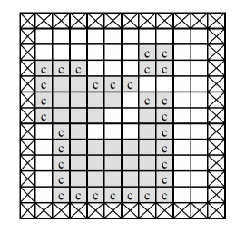
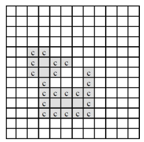
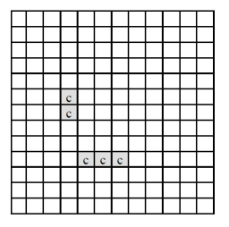

# python

## baek 2636 치즈 골드5

https://www.acmicpc.net/problem/2636

> python3 132ms


* 문제

  > 아래 <그림 1>과 같이 정사각형 칸들로 이루어진 사각형 모양의 판이 있고, 그 위에 얇은 치즈(회색으로 표시된 부분)가 놓여 있다. 판의 가장자리(<그림 1>에서 네모 칸에 X친 부분)에는 치즈가 놓여 있지 않으며 치즈에는 하나 이상의 구멍이 있을 수 있다.
  >
  > 이 치즈를 공기 중에 놓으면 녹게 되는데 공기와 접촉된 칸은 한 시간이 지나면 녹아 없어진다. 치즈의 구멍 속에는 공기가 없지만 구멍을 둘러싼 치즈가 녹아서 구멍이 열리면 구멍 속으로 공기가 들어가게 된다. <그림 1>의 경우, 치즈의 구멍을 둘러싼 치즈는 녹지 않고 ‘c’로 표시된 부분만 한 시간 후에 녹아 없어져서 <그림 2>와 같이 된다.
  >
  > 
  >
  > <그림 1> 원래 치즈 모양
  >
  > 다시 한 시간 후에는 <그림 2>에서 ‘c’로 표시된 부분이 녹아 없어져서 <그림 3>과 같이 된다.
  >
  > 
  >
  > <그림 2> 한 시간 후의 치즈 모양
  >
  > 
  >
  > <그림 3> 두 시간 후의 치즈 모양
  >
  > <그림 3>은 원래 치즈의 두 시간 후 모양을 나타내고 있으며, 남은 조각들은 한 시간이 더 지나면 모두 녹아 없어진다. 그러므로 처음 치즈가 모두 녹아 없어지는 데는 세 시간이 걸린다. <그림 3>과 같이 치즈가 녹는 과정에서 여러 조각으로 나누어 질 수도 있다.
  >
  > 입력으로 사각형 모양의 판의 크기와 한 조각의 치즈가 판 위에 주어졌을 때, 공기 중에서 치즈가 모두 녹아 없어지는 데 걸리는 시간과 모두 녹기 한 시간 전에 남아있는 치즈조각이 놓여 있는 칸의 개수를 구하는 프로그램을 작성하시오.
  
* 입력

  > 첫째 줄에는 사각형 모양 판의 세로와 가로의 길이가 양의 정수로 주어진다. 세로와 가로의 길이는 최대 100이다. 판의 각 가로줄의 모양이 윗 줄부터 차례로 둘째 줄부터 마지막 줄까지 주어진다. 치즈가 없는 칸은 0, 치즈가 있는 칸은 1로 주어지며 각 숫자 사이에는 빈칸이 하나씩 있다.
  >
  > ```bash
  > 13 12
  > 0 0 0 0 0 0 0 0 0 0 0 0
  > 0 0 0 0 0 0 0 0 0 0 0 0
  > 0 0 0 0 0 0 0 1 1 0 0 0
  > 0 1 1 1 0 0 0 1 1 0 0 0
  > 0 1 1 1 1 1 1 0 0 0 0 0
  > 0 1 1 1 1 1 0 1 1 0 0 0
  > 0 1 1 1 1 0 0 1 1 0 0 0
  > 0 0 1 1 0 0 0 1 1 0 0 0
  > 0 0 1 1 1 1 1 1 1 0 0 0
  > 0 0 1 1 1 1 1 1 1 0 0 0
  > 0 0 1 1 1 1 1 1 1 0 0 0
  > 0 0 1 1 1 1 1 1 1 0 0 0
  > 0 0 0 0 0 0 0 0 0 0 0 0
  > ```
  >
  
* 출력

  > 첫째 줄에는 치즈가 모두 녹아서 없어지는 데 걸리는 시간을 출력하고, 둘째 줄에는 모두 녹기 한 시간 전에 남아있는 치즈조각이 놓여 있는 칸의 개수를 출력한다.
  >
  > ```bash
  > 3
  > 5
  > ```


```python
import sys
from collections import deque
input = sys.stdin.readline

dr, dc = (-1, 1, 0, 0), (0, 0, -1, 1)


def sol():
    n, m = map(int, input().split())
    arr = [list(map(int, input().split())) for _ in range(n)]
    res_cnt, res_che = 0, 0

    while 1:
        v, q, che = [[0] * m for _ in range(n)], deque([[0, 0]]), 0

        for i in range(n):
            for j in range(m):
                if arr[i][j]:
                    che += 1

        if not che:
            break

        res_che = che

        while q:
            r, c = q.popleft()

            for d in range(4):
                nr, nc = r + dr[d], c + dc[d]
                if 0 <= nr < n and 0 <= nc < m and not v[nr][nc]:
                    if not arr[nr][nc]:
                        q.append([nr, nc])
                    else:
                        arr[nr][nc] = 0
                    v[nr][nc] = 1

        res_cnt += 1

    print(res_cnt)
    print(res_che)


sol()
```

> 하,, 대체 어떻게 풀어야 하지,, 라는 생각에 치즈에만 집착했다. 그래서 위아래오른쪽왼쪽에서 1을 만나면 처리해 줄 셈산을 하고 있었다. 하지만 이것도 완벽하게 처리해 주는 풀이가 아니었음..
>
> 그런데 다른 사람들 풀이 설명을 읽어보니까 빈공간에서 bfs 써서 돌아다니다가 1을 만나면 그것은 가장자리의 치즈이므로 그부분을 처리해 주면 된다는 것이다.
>
> 너무너무 ,, 생각지도 못한 풀이라서 깜짝 놀랐고, 나는 아직도 부족함을 깨달았다 흑흑


* 모범답안

  ```python
  70
  
  import sys
  input=sys.stdin.readline
  N,M=map(int,input().split())
  MAP=[]
  time=0
  visited=[[False]*M for _ in range(N)]
  for _ in range(N):
      temp=list(map(int,input().split()))
      MAP.append(temp)
  
  d=[(0,1),(0,-1),(1,0),(-1,0)]
  stack,air,hole=[(0,0)],[],[]
  visited[0][0]=True
  while stack:
      c=stack.pop()
      air.append(c)
      for i in range(4):
          nx=c[0]+d[i][0];ny=c[1]+d[i][1];
          if not(0<=nx<N and 0<=ny<M) or visited[nx][ny]:
              continue
          if MAP[nx][ny]:
              continue
          visited[nx][ny]=True
          stack.append((nx,ny))
  cnt=0;
  
  
  while True:
      next_air=[]
  
      while air:
          c=air.pop()
          for i in range(4):
              nx=c[0]+d[i][0];ny=c[1]+d[i][1];
              if not(0<=nx<N and 0<=ny<M) or visited[nx][ny]:
                  continue
              visited[nx][ny]=True
              if MAP[nx][ny]:
                  next_air.append((nx,ny))
              else: # 구멍
                  air.append((nx,ny))
      if not next_air:
          break
      cnt=len(next_air)
      air=next_air
      time+=1
  
  print(time)
  print(cnt)
  ```
  
  > 아 왜 빠른가 했더니.. 나처럼 이중포문 두 개 돌려서 치즈의 칸 수를 센 게 아니라,, deque하면서 빈공간을 세고, 전체 칸에서 그 빈공간을 뺀거구나.. 유레카

