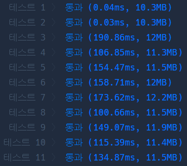

# Python

## pro level2 행렬 테두리 회전하기

https://programmers.co.kr/learn/courses/30/lessons/77485?language=python3


> 


* 문제

  > 

* 입력

  > 
  >
  > ```bash
  > 
  > ```
  
* 출력

  > 
  >
  > ```bash
  > 
  > ```


```python
def solution(rows, columns, queries):
    answer = []
    arr = [[i for i in range(j, j+columns)] for j in range(1, rows*columns, columns)]
    for sr, sc, er, ec in queries:
        tmp, cnt, r, c = [], 0, sr-1, sc-1
        while cnt < ec - sc + 1:
            tmp.append(arr[r][c])
            if len(tmp) == 1:
                continue
            cnt += 1
            arr[r][c] = tmp[-2]
            r, c = r, c + 1
        cnt, r, c = 0, r + 1, c - 1
        while cnt < er - sr:
            tmp.append(arr[r][c])
            cnt += 1
            arr[r][c] = tmp[-2]
            r, c = r + 1, c
        cnt, r, c = 0, r - 1, c - 1
        while cnt < ec - sc:
            tmp.append(arr[r][c])
            cnt += 1
            arr[r][c] = tmp[-2]
            r, c = r, c - 1
        cnt, r, c = 0, r - 1, c + 1
        while cnt < er - sr - 1:
            tmp.append(arr[r][c])
            cnt += 1
            arr[r][c] = tmp[-2]
            r, c = r - 1, c
        arr[sr-1][sc-1] = tmp[-1]
        answer.append(min(tmp))
    return answer
```

> 


* 모범답안

  ```python
  def solution(rows, columns, queries):
      answer = []
  
      board = [[i+(j)*columns for i in range(1,columns+1)] for j in range(rows)]
      # print(board)
  
      for a,b,c,d in queries:
          stack = []
          r1, c1, r2, c2 = a-1, b-1, c-1, d-1
  
  
          for i in range(c1, c2+1):
  
            stack.append(board[r1][i])
              if len(stack) == 1:
                  continue
              else:
                  board[r1][i] = stack[-2]
  
  
          for j in range(r1+1, r2+1):
              stack.append(board[j][i])
              board[j][i] = stack[-2]
  
          for k in range(c2-1, c1-1, -1):
              stack.append(board[j][k])
              board[j][k] = stack[-2]
  
          for l in range(r2-1, r1-1, -1):
              stack.append(board[l][k])
              board[l][k] = stack[-2]
  
          answer.append(min(stack))
  
  
      return answer
  ```
  
  > 역시 for문이 while문보다 빠른 것 같다..

