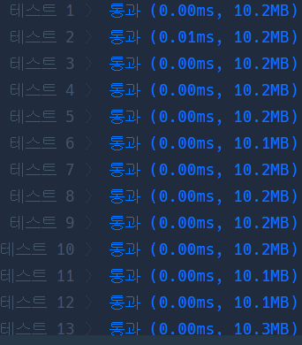

# Python

## pro level1 로또의 최고 순위와 최저 순위

https://programmers.co.kr/learn/courses/30/lessons/77484


> 


* 문제

  > 

* 입력

  > 
  >
  > ```bash
  > 
  > ```
  
* 출력

  > 
  >
  > ```bash
  > 
  > ```


```python
def solution(lottos, win_nums):
    rank = [6, 6, 5, 4, 3, 2, 1]
    zero = lottos.count(0)
    notzero = 0
    for l in lottos:
        if l in win_nums:
            notzero += 1
    sres = zero + notzero
    return [rank[sres], rank[notzero]]
```

> 


* 모범답안

  ```python
  
  ```
  
  > 

