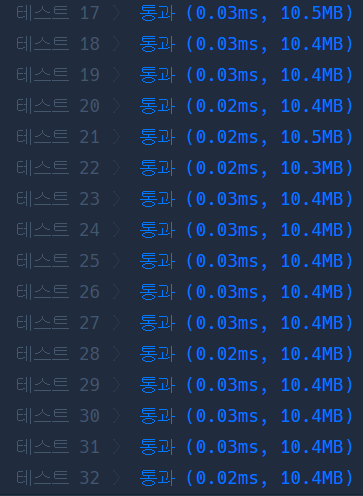

# Python 

## pro level1 다트 게임

https://programmers.co.kr/learn/courses/30/lessons/17682


> 


* 문제

  > 

* 입력

  > 
  >
  > ```bash
  > 
  > ```
  
* 출력

  > 
  >
  > ```bash
  > 
  > ```


```python
def solution(dartResult):
    tmp = ''
    st =  []
    for d in dartResult:
        if d.isdigit():
            tmp += d
        else:
            if d == 'S':
                st.append(int(tmp))
            elif d == 'D':
                st.append(int(tmp)**2)
            elif d == 'T':
                st.append(int(tmp)**3)
            elif d == '*':
                if len(st) > 1:
                    st[-2] = st[-2]*2
                st[-1] = st[-1]*2
            elif d == '#':
                st[-1] = -st[-1]
            tmp = ''
            
    return sum(st)
```

> 


* 모범답안

  ```python
  def solution(dartResult):
      point = []
      answer = []
      dartResult = dartResult.replace('10','k')
      point = ['10' if i == 'k' else i for i in dartResult]
      print(point)
  
      i = -1
      sdt = ['S', 'D', 'T']
      for j in point:
          if j in sdt :
              answer[i] = answer[i] ** (sdt.index(j)+1)
          elif j == '*':
              answer[i] = answer[i] * 2
              if i != 0 :
                  answer[i - 1] = answer[i - 1] * 2
          elif j == '#':
              answer[i] = answer[i] * (-1)
          else:
              answer.append(int(j))
              i += 1
      return sum(answer)
  ```

  > replace를 엄청 잘 활용한 코드.
  >
  > 10인 문자는 바로 문자 하나로 바꿈.

