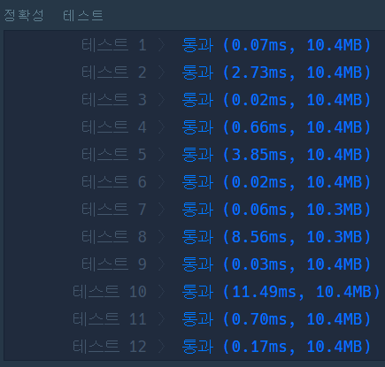
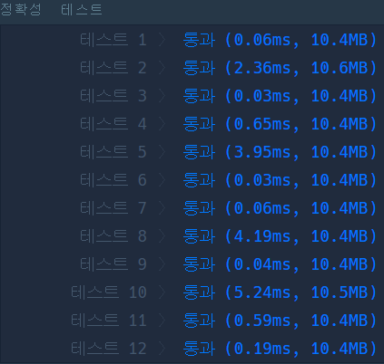

# Python 

## pro level2 소수 찾기

https://programmers.co.kr/learn/courses/30/lessons/42839

> 


* 문제

  > 

* 입력

  > 
  >
  > ```bash
  > 
  > ```
  
* 출력

  > 
  >
  > ```bash
  > 
  > ```
  
  

```python
from itertools import permutations
from math import sqrt

def solution(numbers):
    answer = 0
    n = len(numbers)
    num = set()
    for i in range(1, n+1):
        for perm in permutations(numbers, i):
            num.add(int(''.join(perm)))
            
    num = list(num)
    for i in range(len(num)):
        flag = False
        if num[i] <= 1:
            continue
        for j in range(2, int(sqrt(num[i])) + 1):
            if num[i] % j == 0:
                flag = True
                break
        if not flag:
            answer += 1
    return answer
```

>- `from math import sqrt`
>- 현재 숫자의 루트 값 + 1 을 한 숫자를 for문으로 돌려 나눠지는 수가 하나도 없으면 소수이다.


- 두번째 풀이



```python
from itertools import permutations

def solution(numbers):
    answer = 0
    n = len(numbers)
    num = set()
    for i in range(1, n+1):
        for perm in permutations(numbers, i):
            num.add(int(''.join(perm)))
            
    num = list(num)
    for number in num:
        flag = False
        if number <= 1:
            continue
        for j in range(2, int(number ** 0.5) + 1):
            if number % j == 0:
                flag = True
                break
        if not flag:
            answer += 1
    return answer
```

> 오호 sqrt안쓰고 **0.5 쓰니까 2배나 빨라졌다.


* 모범답안

  ```python

  ```
  
  > 내거가 젤 빠름,,, 다른 풀이 안배울래

