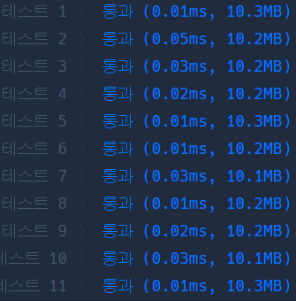

# Python 

## pro level2 기능개발

https://programmers.co.kr/learn/courses/30/lessons/42586

> 


* 문제

  > 

* 입력

  > 
  >
  > ```bash
  > 
  > ```
  
* 출력

  > 
  >
  > ```bash
  > 
  > ```


```python
from collections import deque
def solution(progresses, speeds):
    answer = []
    progresses, speeds = deque(progresses), deque(speeds)
    
    while progresses:
        for i in range(len(progresses)):
            progresses[i] += speeds[i]
        print(progresses)
        i, cnt = 0, 0
        
        while progresses and progresses[0] >= 100:
            cnt += 1
            progresses.popleft()
            speeds.popleft()
            
        if cnt:
            answer.append(cnt)
            
    return answer
```

> 


* 모범답안

  

  ```python
  def solution(progresses, speeds):
      Q=[]
      for p, s in zip(progresses, speeds):
          if len(Q)==0 or Q[-1][0]<-((p-100)//s):
              Q.append([-((p-100)//s),1])
          else:
              Q[-1][1]+=1
      return [q[1] for q in Q]
  
  ```

  > 아진짜 천재같네.. 날짜를 Q에 넣고 그다음에 들어올 날짜가 미리 들어와있는 날짜보다 적으면 같이 계산해준다. 훨씬 빠르네 멋지다.

