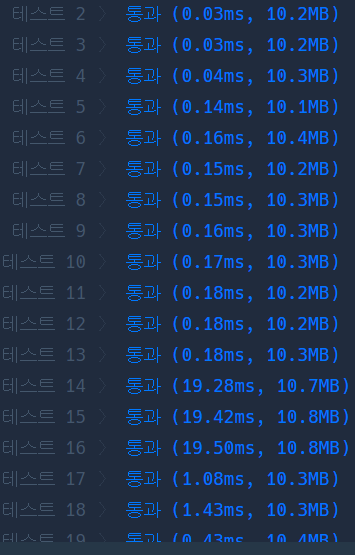

# Python 

## pro level3 프린터

https://programmers.co.kr/learn/courses/30/lessons/42628

> 


* 문제

  > 

* 입력

  > 
  >
  > ```bash
  > 
  > ```
  
* 출력

  > 
  >
  > ```bash
  > 
  > ```


```python
def solution(n, t, m, p):
    answer = ''
    num = [0]
    alphabet = ['A', 'B', 'C', 'D', 'E', 'F']
    realnumber = 1

    while 1:
        if len(num) > t * m:
            break
        tmp = []
        number = realnumber

        while number >= n:
            if 10 <= number % n <= 15:
                tmp.append(alphabet[(number % n) - 10])
            else:
                tmp.append(number % n)
            number //= n
            
        if 10 <= number <= 15:
            tmp.append(alphabet[number - 10])
        else:
            tmp.append(number)

        num += tmp[::-1]
        realnumber += 1

    for i in range(p - 1, t * m, m):
        if len(answer) == t:
            break
        answer += str(num[i])

    return answer
```

>아 나 참 어이가 없어가지고,,, 첫 while문 앞 줄에 10에서 15 사이이면 무조건 알파벳으로 변환한다음 다음 숫자로 넘어가는 거로 되어 있어갖고 계속 틀렸었다.. 그럼 그렇지... 하.. ㅋㅋㅋㅋㅋ ㅠㅠ 제대로 해석하고 풀 걸 그랬다.


* 모범답안

  

  ```python
  big = ["A","B","C","D","E","F"]
  def solution(n, t, m, p):
      a="0"
      i=0
      #for i in range(t*m):
      while True:
          if len(a)>=t*m:
              break
          b=""
          j=i
          while (j):
              if j%n>9:
                  b=big[j%n-10]+b
              else:
                  b=str(j%n)+b
              j=j//n
          a=a+b
          i=i+1
      answer = a[p-1::m][:t]
      return answer
  
  ```
  
  > 나보다 조금 느린 정도인데 코드는 간결하다. 그렇군 그냥 배열을 쓸 필요 없이 스트링으로 하면 되는군.

