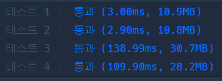
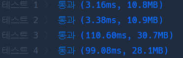

# Python 

## pro level2 전화번호 목록

https://programmers.co.kr/learn/courses/30/lessons/42577

> 


* 문제

  > 

* 입력

  > 
  >
  > ```bash
  > 
  > ```
  
* 출력

  > 
  >
  > ```bash
  > 
  > ```


```python
def solution(phone_book):
    answer = True
    phone_book.sort()
    for i in range(1, len(phone_book)):
        if phone_book[i-1] == phone_book[i][:len(phone_book[i-1])]:
            answer = False
            break
    return answer
```

> 


* 모범답안

  

  ```python
  def solution(phoneBook):
      phoneBook = sorted(phoneBook)
  
      for p1, p2 in zip(phoneBook, phoneBook[1:]):
          if p2.startswith(p1):
              return False
      return True
  ```

  > zip.. 오옹,,,
  >
  > 0번째 인덱스부터 시작하는 phoneBook과 1번째 인덱스부터 시작하는 phoneBook[1:] 
  >
  > 이걸 zip으로 묶은 다음 p1 p2 에 각각 대입함.
  >
  > 그리고 startswith와 같이
  >
  > p2 앞글자에 p1이 있으면 바로 false를 리턴..

