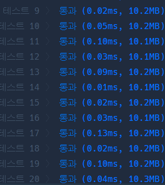

# Python 

## pro level2 프린터

https://programmers.co.kr/learn/courses/30/lessons/42587

> 


* 문제

  > 

* 입력

  > 
  >
  > ```bash
  > 
  > ```
  
* 출력

  > 
  >
  > ```bash
  > 
  > ```


```python
from collections import deque

def solution(priorities, location):
    answer = 1
    arr = deque([])
    for i in range(len(priorities)):
        arr.append([priorities[i], i])
    priorities.sort(key = lambda x : -x)
    idx = 0
    
    while arr:
        if arr[0][0] == priorities[idx]:
            if arr[0][1] == location:
                return answer
            arr.popleft()
            idx += 1
            answer += 1
        else:
            arr.append(arr.popleft())
    
    return answer
```

>이거는 모,, 쉽징
>
>프린터기 대기열을 인덱스와 함께 새로운 배열에 저장해 준 뒤, 프린터 대기열을 정렬함.
>
>그리고 이제 대기열을 돌면서, 만약 현재 우선순위와 대기열 첫 번째 프린터가 같다면, 그리고 알고 싶은 프린터라면 return하고 끝냄. 하지만, 그게 알고 싶은 게 아니라면 단순히 대기열에서 빼내고 인덱스와 찾는 시간을 1씩 올려 줌.
>
>마지막으로, 대기열 첫 번째 프린터가 아니라면 pop한 것을 그대로 append해줌.


* 모범답안

  ```python
  def solution(priorities, location):
      queue =  [(i,p) for i,p in enumerate(priorities)]
      answer = 0
      while True:
          cur = queue.pop(0)
          if any(cur[1] < q[1] for q in queue):
              queue.append(cur)
          else:
              answer += 1
              if cur[0] == location:
                  return answer
  ```

  > 으음~ 프린터 하나 씩 pop한다. 그리고 any를 써서 프린터 모두를 돌며, 어떤 것이라도 현재 프린터보다 우선순위 이상인 게 있으면 다시 append해주고 그러는구나. 근데 계속 모든 프린터를 돌며 비교과정을 거쳐야 하기 때문에 시간은 오래 걸린다. 코드는 간결하네

