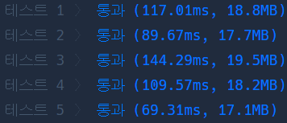

# Python 

## pro level2 주식가격

https://programmers.co.kr/learn/courses/30/lessons/42584

> 


* 문제

  > 

* 입력

  > 
  >
  > ```bash
  > 
  > ```
  
* 출력

  > 
  >
  > ```bash
  > 
  > ```


```python
def solution(prices):
    answer = []
    for i in range(len(prices)):
        tmp = 0
        for j in range(i+1, len(prices)):
            tmp += 1
            if prices[i] > prices[j]:
                break
            else: continue
        answer.append(tmp)
    return answer
```

>


* 모범답안

  

  ```python
  
  ```

  > 

