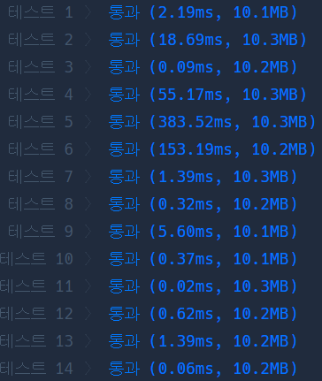
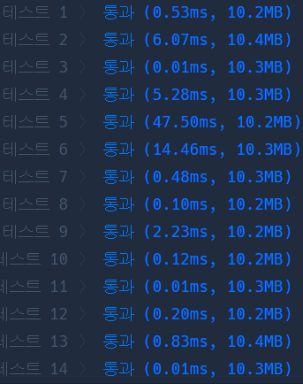

# Python 

## pro level2 다리를 지나는 트럭

https://programmers.co.kr/learn/courses/30/lessons/42583

> 


* 문제

  > 

* 입력

  > 
  >
  > ```bash
  > 
  > ```
  
* 출력

  > 
  >
  > ```bash
  > 
  > ```


```python
from collections import deque

def solution(bridge_length, weight, truck_weights):
    answer = 0
    q, truck_weights, sumq = deque([]), deque(truck_weights), 0
    
    while truck_weights or q:
        while q and q[0][1] == bridge_length:
                sumq -= q[0][0]
                q.popleft()
                
        if truck_weights and sumq + truck_weights[0] <= weight and len(q) < bridge_length:
                sumq += truck_weights[0]
                q.append([truck_weights.popleft(), 0])
                
        for i in range(len(q)):
            q[i][1] += 1
            
        if q or truck_weights: answer += 1
            
    return answer+1
```

>왜인지 엄청 안풀렸다.. 스스로 문제에 대해 제대로 이해를 못했기 때문이었겠지. 다시 풀이 방법을 분석해 보자. 일단 대기중인 트럭과 지나가는 차 목록에 차가 존재하는 동안에 while문은 돌아간다. 우선, 지나가는 차가 있다면, 또한 그 차가 이미 다리의 길이를 모두 지나갔다면, 다리에 존재하는 차의 큐에서 빼준다. 
>
>이제 대기 중인 차를 본다. 대기 중인 맨 첫 번째 차가 다리위에 올라가도 무게가 넘치지 않으며, 다리에 안정적인 길이를 유지할 수 있다면 그 차 역시 태운다.
>
>마지막으로 현재 다리의 차들이 이동 거리를 판단하기 위해 for문을 돌려줌. 그리고 아직도 다 못지나간 차들이 존재한다면 시간은 계속 1씩 증가.
>
>그런데 answer는 왜 1을 더해야하는 지 모르겠음


* 모범답안

  

  ```python
  from collections import deque
  
  def solution(bridge_length, weight, truck_weights):
      bridge = deque(0 for _ in range(bridge_length))
      total_weight = 0
      step = 0
      truck_weights.reverse()
  
      while truck_weights:
          total_weight -= bridge.popleft()
          if total_weight + truck_weights[-1] > weight:
              bridge.append(0)
          else:
              truck = truck_weights.pop()
              bridge.append(truck)
              total_weight += truck
          step += 1
  
      step += bridge_length
  
      return step
  ```

  > 아아 나는 하나씩 시간을 더해줬다면 이사람은 truck자체가 비었을 때 모든 트럭이 다리에 있게 되는 거니까 다리의 길이를 마지막에 더해주고 끝냄.

