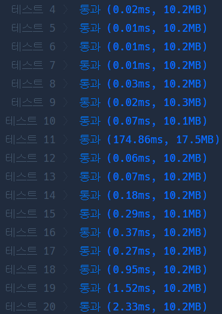
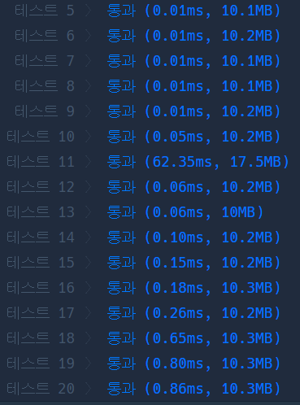

# Python 

## pro level2 캐시

https://programmers.co.kr/learn/courses/30/lessons/17680

> 


* 문제

  > 

* 입력

  > 
  >
  > ```bash
  > 
  > ```
  
* 출력

  > 
  >
  > ```bash
  > 
  > ```


```python
def solution(cacheSize, cities):
    answer = 0
    q = deque([])
    
    for c in cities:
        c = c.upper()
        if c in q:
            flag = 0
            for i in range(len(q)):
                if q[i] == c:
                    flag = 1
                if flag and i+1 < len(q):
                    q[i] = q[i+1]
            q[-1] = c
            answer += 1
            
        else:
            if q and len(q) == cacheSize:
                q.popleft()
            if len(q) < cacheSize:
                q.append(c)
            answer += 5
        
            
    return answer

```

>


* 모범답안

  

  ```python
  
  def solution(cacheSize, cities):
      import collections
      cache = collections.deque(maxlen=cacheSize)
      time = 0
      for i in cities:
          s = i.lower()
          if s in cache:
              cache.remove(s)
              cache.append(s)
              time += 1
          else:
              cache.append(s)
              time += 5
      return time
  ```
  
  > 충격.. python도 deque에 remove 내장 함수가 있었다.

