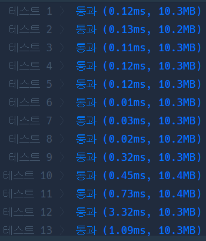

# Python

## pro level2 후보키

https://programmers.co.kr/learn/courses/30/lessons/42890#qna


> 


* 문제

  > 

* 입력

  > 
  >
  > ```bash
  > 
  > ```
  
* 출력

  > 
  >
  > ```bash
  > 
  > ```


```python
from itertools import combinations


def solution(relation):
    answer = []
    n = list(i for i in range(len(relation[0])))
    cnt = 1
    while len(n) >= cnt:
        for comb in combinations(n, cnt):
            count = 0
            flag = True
            dicgttwo, dicone = [], {}
            for idx in comb:
                if cnt == 1:
                    for i in range(len(relation)):
                        if relation[i][idx] in dicone:
                            flag = False
                            break
                        else:
                            dicone[relation[i][idx]] = 1
                else:
                    count += 1
                    for i in range(len(relation)):
                        if len(dicgttwo) == len(relation):
                            if count == len(comb):
                                if dicgttwo[i] + str(relation[i][idx]) in dicgttwo:
                                    flag = False
                                    break
                                else:
                                    dicgttwo[i] += str(relation[i][idx])
                            else:
                                dicgttwo[i] += str(relation[i][idx])
                        else:
                            dicgttwo.append(str(relation[i][idx]))
                if not flag:
                    break
            if not flag:
                continue
            answer.append(comb)
        cnt += 1

    result = []
    for i in range(len(answer)):
        tmp, tmpflag = ''.join(map(str, answer[i])), True
        for j in range(len(result)):
            cnt = 0
            for k in range(len(result[j])):
                if result[j][k] in tmp:
                    cnt += 1
            if cnt == len(result[j]):
                tmpflag = False
                break
        if tmpflag:
            result.append(tmp)

    return len(result)
```

> 


* 모범답안

  ```python
  def solution(relation):
      answer_list = list()
      for i in range(1, 1 << len(relation[0])):
          tmp_set = set()
          for j in range(len(relation)):
              tmp = ''
              for k in range(len(relation[0])):
                  if i & (1 << k):
                      tmp += str(relation[j][k])
              tmp_set.add(tmp)
  
          if len(tmp_set) == len(relation):
              not_duplicate = True
            for num in answer_list:
                  if (num & i) == num:
                      not_duplicate = False
                      break
              if not_duplicate:
                  answer_list.append(i)
      return len(answer_list)
  
  ```
  
  > 

