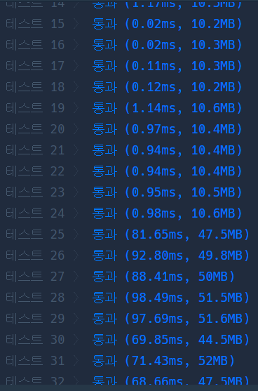

# Python

## pro level2 오픈채팅방

https://programmers.co.kr/learn/courses/30/lessons/42888?language=python3


> 


* 문제

  > 

* 입력

  > 
  >
  > ```bash
  > 
  > ```
  
* 출력

  > 
  >
  > ```bash
  > 
  > ```


```python
def solution(record):
    answer = []
    dic = {}
    for i in range(len(record)):    # 처음 반복문을 돌면서
        tmp = record[i].split()     # 띄어쓰기를 기준으로 문자열을 나눔
        if tmp[0] == 'Enter':       # 입장일 때 이름 덮어쓰기
            dic[tmp[1]] = tmp[2]
        elif tmp[0] == 'Leave':
            continue
        else:
            dic[tmp[1]] = tmp[2]
            
    for i in range(len(record)):    # 두 번째 반복문. 출력값에 넣음.
        tmp = record[i].split()
        if tmp[0] == 'Enter':
            answer.append(dic[tmp[1]] + '님이 들어왔습니다.')
        elif tmp[0] == 'Leave':
            answer.append(dic[tmp[1]] + '님이 나갔습니다.')
    return answer
```

> 엄청 쉬웠다. 문자열이 가벼운 파이썬이라 쉬웠던 건지?


* 모범답안

  ```python
  def solution(record):
      answer = []
      namespace = {}
      printer = {'Enter':'님이 들어왔습니다.', 'Leave':'님이 나갔습니다.'}
      for r in record:
          rr = r.split(' ')
          if rr[0] in ['Enter', 'Change']:
              namespace[rr[1]] = rr[2]
  
      for r in record:
          if r.split(' ')[0] != 'Change':
              answer.append(namespace[r.split(' ')[1]] + printer[r.split(' ')[0]])
  
      return answer
  ```
  
  > 반복문을 돌긴 해야하나봄

