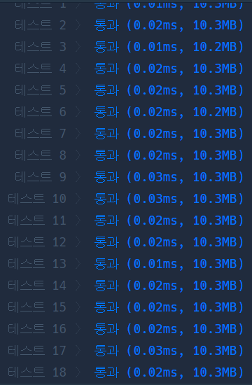

# Python 

## pro level2 상호 평가

https://programmers.co.kr/learn/courses/30/lessons/83201

> 


* 문제

  > 

* 입력

  > 
  >
  > ```bash
  > 
  > ```
  
* 출력

  > 
  >
  > ```bash
  > 
  > ```
  
  

```python
def solution(scores):
    answer = ''
    grade = {90: 'A', 80: 'B', 70: 'C', 60: 'D', 50: 'D'}
    n = len(scores)
    scores = list(zip(*scores))
    
    for s in range(n):
        scores[s], flag = list(scores[s]), 0
        if scores[s][s] == max(scores[s]) and scores[s].count(scores[s][s]) == 1:
            scores[s][s] = -1
            flag = 1
        if scores[s][s] == min(scores[s]) and scores[s].count(scores[s][s]) == 1:
            scores[s][s] = -1
            flag = 1
        
        if flag:
            mean = ((sum(scores[s]) + 1) // ((n-1)*10)) * 10
            if mean in grade:
                answer += grade[mean]
            else:
                answer += 'F'
        else:
            mean = (sum(scores[s]) // ((n)*10)) * 10
            if mean in grade:
                answer += grade[mean]
            else:
                answer += 'F'    
    
    return answer
```

>


* 모범답안

  

  ```python
  from collections import Counter
  def solution(scores):   
      answer = ''
  
      for idx, score in enumerate(list(map(list, zip(*scores)))):
          length = len(score)
          if Counter(score)[score[idx]] == 1 and (max(score) == score[idx] or min(score) == score[idx]):
              del score[idx]
              length -= 1
  
          grade = sum(score) / length
  
          if grade >= 90:
              answer += 'A'
          elif grade >= 80:
              answer += 'B'
          elif grade >= 70:
              answer += 'C'
          elif grade >= 50:
              answer += 'D'
          else:
              answer += 'F'
  
      return answer
  ```
  
  > 

