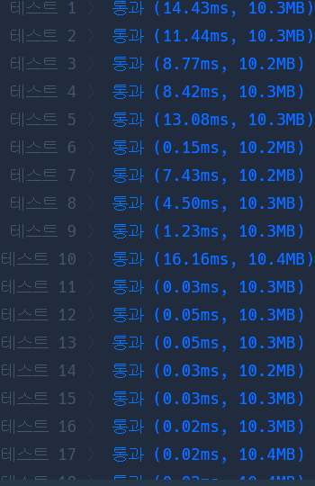
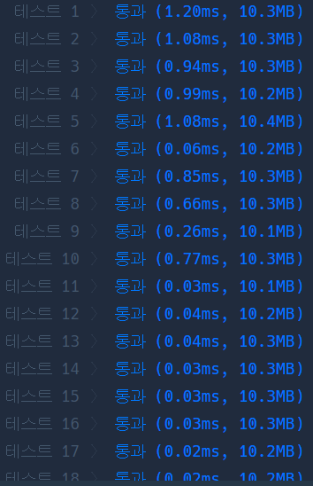

# Python 

## pro level3 디스크 컨트롤러

https://programmers.co.kr/learn/courses/30/lessons/42627

> 


* 문제

  > 

* 입력

  > 
  >
  > ```bash
  > 
  > ```
  
* 출력

  > 
  >
  > ```bash
  > 
  > ```


```python
from heapq import heappush, heappop

def solution(jobs):
    answer = 0
    # heapq, 작업 길이, 현재 시간, 작업 방문 표시, 방문한 작업 개수
    heap, n, now, v, cnt = [], len(jobs), 0, [0] * len(jobs), 0
    
    # 현재 시간 이전에 요청이 들어온 작업들을
    # 작업 시간 순으로 힙큐에 넣어줌.
    # 힙큐에 여러 작업들이 들어가 있다 하더라도
    # 하나의 작업만 처리해 줌.
    # 그 이유는 현재 작업이 실행 중일 때에
    # 짧은 작업시간을 가진 작업이 들어올 수도 있기 때문에.
    # 그리고 모든 작업이 처리되었을 경우 종료.
    
    while cnt < n:
        for j in range(len(jobs)):
            if jobs[j][0] <= now and not v[j]:
                heappush(heap, [jobs[j][1], jobs[j][0], j])
                v[j] = 1
        if heap:
            job, req, idx = heappop(heap)
            cnt += 1
            if 0 < now - req:
                answer += (now - req) + job
                now += job
            else:
                answer += job
                now += job
        else:
            now += 1
        
    return answer // n
```

>아 진짜 이 방법이 왜 생각이 안났지? 분명 언젠가 풀어 본 적이 있다. 그것도 엄청 최근에,, 해당되는 값을 계속 힙에 넣고 가장 작은 작업만 하나 씩 빼내는 것..


* 모범답안

  

  ```python
  import heapq
  from collections import deque
  
  def solution(jobs):
      tasks = deque(sorted([(x[1], x[0]) for x in jobs], key=lambda x: (x[1], x[0])))
      print(tasks)
      q = []
      heapq.heappush(q, tasks.popleft())
      current_time, total_response_time = 0, 0
      while len(q) > 0:
          dur, arr = heapq.heappop(q)
          current_time = max(current_time + dur, arr + dur)
          total_response_time += current_time - arr
          while len(tasks) > 0 and tasks[0][1] <= current_time:
              heapq.heappush(q, tasks.popleft())
          if len(tasks) > 0 and len(q) == 0:
              heapq.heappush(q, tasks.popleft())
      return total_response_time // len(jobs)
  ```

  > 아 알겠다.
  >
  > 나는 q가 없을 때 now를 1씩 높였는데, 여기서는 바로 과감하네 바로 다음 작업으로 넘어 가네. 그래서 엄청 빠른거구나.

