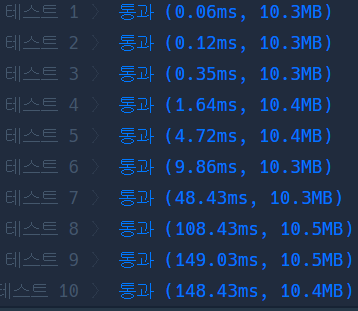
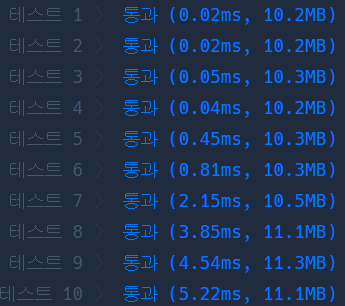

# Python 

## pro level3 순위

https://programmers.co.kr/learn/courses/30/lessons/49191

> 


* 문제

  > 

* 입력

  > 
  >
  > ```bash
  > 
  > ```
  
* 출력

  > 
  >
  > ```bash
  > 
  > ```


```python
def solution(n, results):
    answer = 0
    arr = [[float('inf')] * (n+1) for _ in range(n+1)]
    
    for a, b in results:
        # 출발 -> 도착 출발 승
        arr[b][a] = 1
        arr[a][b] = 2
        arr[a][a] = 0
        arr[b][b] = 0
        # print(a, b)
    
    for i in range(1, n+1): # 출 -> 경 
        for j in range(1, n+1):
            for k in range(1, n+1):
                if arr[j][i] == 1 and arr[i][k] == 1:
                    arr[j][k] = 1
                elif arr[j][i] == 2 and arr[i][k] == 2:
                    arr[j][k] = 2
                    
    for i in range(1, n+1):
        flag = True
        for j in range(1, n+1):
            if arr[i][j] == float('inf'):
                flag = False
                break
        if flag:
            answer += 1
    
    return answer
```

>


* 모범답안

  

  ```python
  from collections import defaultdict
  def solution(n, results):
      answer = 0
      win, lose = defaultdict(set), defaultdict(set)
      for result in results:
              lose[result[1]].add(result[0])
              win[result[0]].add(result[1])
  
      for i in range(1, n + 1):
          for winner in lose[i]: win[winner].update(win[i])
          for loser in win[i]: lose[loser].update(lose[i])
  
      for i in range(1, n+1):
          if len(win[i]) + len(lose[i]) == n - 1: answer += 1
      return answer
  ```

  > 

