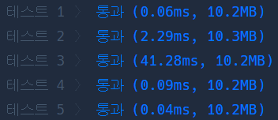
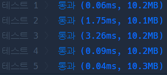
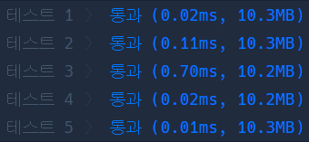

# Python 

## pro level3 단어 변환

https://programmers.co.kr/learn/courses/30/lessons/43163

> 


* 문제

  > 

* 입력

  > 
  >
  > ```bash
  > 
  > ```
  
* 출력

  > 
  >
  > ```bash
  > 
  > ```


```python
from collections import deque, Counter

def solution(begin, target, words):
    answer = 0
    q = deque([[begin, 0]])
    
    while q:
        word, cnt = q.popleft()
        if word == target:
            answer = cnt
            break
        if len(words) < cnt:
            answer = 0
            break
        for i in range(len(words)):
            if len(Counter(word) - Counter(words[i])) == 1:
                q.append([words[i], cnt+1])
                
    return answer
```

> words안에 있는,, 한 글자만 다른 모든 단어로 바꿀 수 있다고 생각하여 일부러 방문표시를 하지 않았다. 그 이유는 방문표시를 하게 되면 이미 방문했던 것 중에 더 최적의 과정이 있을 것이라 생각했기 때문이다. 그런데 모범답안을 보니 방문처리를 한 게 있었다. 그래서 나도 한 번 해보니까 더 빠른 시간을 갖고 통과. ㄷㄷ


- 두 번째 풀이



```python
from collections import deque, Counter

def solution(begin, target, words):
    answer = 0
    q, v = deque([[begin, 0]]), [0] * len(words)
    
    while q:
        word, cnt = q.popleft()
        if word == target:
            answer = cnt
            break
        if len(words) < cnt:
            answer = 0
            break
        for i in range(len(words)):
            if len(Counter(word) - Counter(words[i])) == 1 and\
            not v[i]:
                v[i] = 1
                q.append([words[i], cnt+1])
                
    return answer
```


* 모범답안

  

  ```python
  from collections import deque
  
  
  def get_adjacent(current, words):
      for word in words:
          if len(current) != len(word):
              continue
  
          count = 0
          for c, w in zip(current, word):
              if c != w:
                  count += 1
  
          if count == 1:
              yield word
  
  
  def solution(begin, target, words):
      dist = {begin: 0}
      queue = deque([begin])
  
      while queue:
          current = queue.popleft()
  
          for next_word in get_adjacent(current, words):
              if next_word not in dist:
                  dist[next_word] = dist[current] + 1
                  queue.append(next_word)
  
      return dist.get(target, 0)
  ```

  > 흠.. yield는 모르겠다 도저히..
  >
  > zip을 통해서는 원소 하나 씩 하나 씩 비교해 주는 듯 함.

