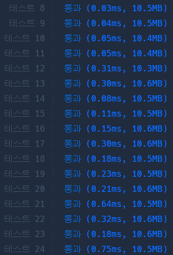

# Python 

## pro level3 셔틀버스

https://programmers.co.kr/learn/courses/30/lessons/17678

> 


* 문제

  > 

* 입력

  > 
  >
  > ```bash
  > 
  > ```
  
* 출력

  > 
  >
  > ```bash
  > 
  > ```


```python
from collections import defaultdict

def solution(n, t, m, timetable):
    answer = ''
    # 차례대로 시간을 정리하기 위해 sort
    timetable.sort()
    # 버스 운행 시간 배열, 버스 운행 첫시간, 버스에 탑승한 크루 저장 hash
    time, ctime, bus = [], '09:00', defaultdict(list)
    
    # 버스 운행 시간 배열 초기화
    for _ in range(n):
        time.append(ctime)
        bus[ctime] = []
        hour = int(ctime[:2])
        minute = int(ctime[3:]) + t
        if minute >= 60:
            hour += 1
            minute = 60 - minute
        hour, minute = format(hour, '02'), format(minute, '02')
        ctime = hour + ':' + minute
        
    # timetable 인덱스
    timeidx = 0
    # 버스 운행 시간 동안 탈 수 있는 탑승객 hash에 저장
    for i in range(n):
        while timeidx < len(timetable) and \
        timetable[timeidx] <= time[i] and len(bus[time[i]]) < m:
            bus[time[i]].append(timetable[timeidx])
            timeidx += 1
    
    # 만약 마지막 버스에 탑승객이 적다면
    if len(bus[time[-1]]) < m:
        answer = time[-1]   # 결과로 저장
    # 마지막 버스 탑승객이 꽉 차있다면
    else:
        # 마지막 버스의 마지막 탑승객보다 1분 더 일찍 타도록 함.
        ctime = bus[time[-1]][-1]
        hour = int(ctime[:2])
        minute = int(ctime[3:]) -1
        if minute == -1:
            hour -= 1
            minute = 59
        hour, minute = format(hour, '02'), format(minute, '02')
        answer = hour + ':' + minute
    
    return answer
```

> - 드디어 defaultdict를 처음 써봤는데 엄청 간편하고 좋다. 앞으로 애용해야지
> - __format__
>   - hour = format(hour, '02')
>     - 현재 int형이 hour를 2자리 수로 맞춰줌.
> - 그리고 처음 사람들 탑승 시간을 for문으로 돌면서 버스에 태우려고 했는데 엄청 복잡하고 뭔가 풀리지 않는 기분이었다. 그래서 버스 개수에 맞춰 사람들을 while문으로 태웠는데 그 이후로 부터 아주 수월하게 풀렸음.
> - 그리고 마지막 정답을 맞추는 건 약간 그리디하게 푼 것 같다. 그래서 통과 안될 줄 알았는데 이게 통과가 되다니.. 일단 존재하는 가장 뒷버스에 태우고, 마지막 탈 사람보다 1분 빠르면 된다. 그러면 탑승 가능


* 모범답안

  ```python
  def solution(n,t,m,timetable):
      timetable=[int(i[:2])*60+int(i[3:]) for i in timetable]
      timetable.sort()
      bustable=[9*60+t*i for i in range(n)]
      for i in bustable:
          passenger=[p for p in timetable if p<=i]
          if i==bustable[-1]:
              if len(passenger)>=m:
                  answer=passenger[m-1]-1
              elif len(passenger)<m:
                  answer=i
              else:
                  answer=passenger[-1]
          elif len(passenger)<m:
              timetable=timetable[len(passenger):]
          elif len(passenger)>=m:
              timetable=timetable[m:]
      answer= str(divmod(answer,60)[0]).rjust(2,'0')+':'+str(divmod(answer,60)[1]).rjust(2,'0')
      return answer
  ```

  > 그냥 내 코드가 더 멋진 것 같다!!
  >
  > 여기서 배울 점은 divmod와 rjust
  >
  > - divmode
  >   - divmod(90, 3)
  >     (30, 0)
  >     divmod(90, 2)
  >     (45, 0)
  >     divmod(90, 4)
  >     (22, 2)
  >   - 이런식으로 결과값이 tuple형태로 출력됨
  > - rjust
  >   - 문자열 자리수 채우는 함수
  >   - a = '434242'
  >   - a.rjust(8, '0')
  >     '00434242'
  >   - 이런식으로 (자리수, 채우고 싶은 문자열) 입력하는 함수
  >   - 이거 찾다가 갑자기 replace까먹어서 찾아봄
  >   - a = '3'
  >     a.zfill(5)
  >     '00003'
  >   - zfill은 이렇게 쓰는 것이다.
  > - replace
  >   - a = '010494920'
  >     a.replace('0', '8')
  >     '818494928'

