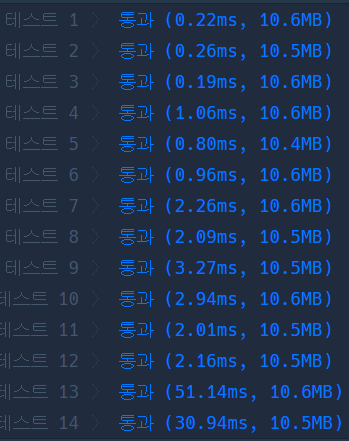

# Python 

## pro level3 블록 이동하기

https://programmers.co.kr/learn/courses/30/lessons/60063

> 


* 문제

  > 

* 입력

  > 
  >
  > ```bash
  > 
  > ```
  
* 출력

  > 
  >
  > ```bash
  > 
  > ```
  
  

```python
from collections import deque

dr = (-1, 1, 0, 0)
dc = (0, 0, -1, 1)

def solution(board):
    answer = 0
    N = len(board)
    v = [[0] * N for _ in range(N)]
    v2 = [[0] * N for _ in range(N)]
    v[0][0], v2[0][0] = 1, 1
    heap = deque([[0, [0, 0], [0, 1]]])
    
    while heap:
        wt, b1, b2 = heap.popleft()
        tb1, tb2 = b1[:], b2[:]
        
        if (tb1[0] == N-1 and tb1[1] == N-1) or \
        (tb2[0] == N-1 and tb2[1] == N-1):
            answer = wt
            break
        
        for i in range(4):
            ntb1 = [tb1[0] + dr[i], tb1[1] + dc[i]]
            ntb2 = [tb2[0] + dr[i], tb2[1] + dc[i]]
            if 0 <= ntb1[0] < N and 0 <= ntb1[1] < N and\
            0 <= ntb2[0] < N and 0 <= ntb2[1] < N:
                if ntb1[0] != ntb2[0] and ntb1[1] == ntb2[1]:
                    if not v2[ntb1[0]][ntb1[1]] or not v2[ntb2[0]][ntb2[1]]:
                        if not board[ntb1[0]][ntb1[1]] and not board[ntb2[0]][ntb2[1]]:
                            heap.append([wt+1, ntb1, ntb2])
                            v2[ntb1[0]][ntb1[1]], v2[ntb2[0]][ntb2[1]] = 1, 1
                if ntb1[0] == ntb2[0] and ntb1[1] != ntb2[1]:
                    if not v[ntb1[0]][ntb1[1]] or not v[ntb2[0]][ntb2[1]]:
                        if not board[ntb1[0]][ntb1[1]] and not board[ntb2[0]][ntb2[1]]:
                            heap.append([wt+1, ntb1, ntb2])
                            v[ntb1[0]][ntb1[1]], v[ntb2[0]][ntb2[1]] = 1, 1
                            
        if tb1[0] == tb2[0] and tb1[1] != tb2[1]:
            for i in range(2):
                ntb2 = [tb1[0] + dr[i], tb1[1] + dc[i]]
                if 0 <= ntb2[0] < N and 0 <= ntb2[1] < N and \
                not board[ntb2[0]][ntb2[1]] and not board[ntb2[0]][tb2[1]]:
                    if not v2[ntb2[0]][ntb2[1]] or not v2[tb1[0]][tb1[1]]:
                        heap.append([wt+1, tb1, ntb2])
                        v2[ntb2[0]][ntb2[1]], v2[tb1[0]][tb1[1]] = 1, 1
                    
            for i in range(2):
                ntb1 = [tb2[0] + dr[i], tb2[1] + dc[i]]
                if 0 <= ntb1[0] < N and 0 <= ntb1[1] < N and \
                not board[ntb1[0]][ntb1[1]] and not board[ntb1[0]][tb1[1]]:
                    if not v2[ntb1[0]][ntb1[1]] or not v2[tb2[0]][tb2[1]]:
                        heap.append([wt+1, ntb1, tb2])
                        v2[ntb1[0]][ntb1[1]], v2[tb2[0]][tb2[1]] = 1, 1
                    
        if tb1[0] != tb2[0] and tb1[1] == tb2[1]:
            for i in range(2, 4):
                ntb2 = [tb1[0] + dr[i], tb1[1] + dc[i]]
                if 0 <= ntb2[0] < N and 0 <= ntb2[1] < N and \
                not board[ntb2[0]][ntb2[1]] and not board[tb2[0]][ntb2[1]]:
                    if not v[ntb2[0]][ntb2[1]] or not v[tb1[0]][tb1[1]]:
                        heap.append([wt+1, tb1, ntb2])
                        v[ntb2[0]][ntb2[1]], v[tb1[0]][tb1[1]] = 1, 1
                    
            for i in range(2, 4):
                ntb1 = [tb2[0] + dr[i], tb2[1] + dc[i]]
                if 0 <= ntb1[0] < N and 0 <= ntb1[1] < N and \
                not board[ntb1[0]][ntb1[1]] and not board[tb1[0]][ntb1[1]]:
                    if not v[ntb1[0]][ntb1[1]] or not v[tb2[0]][tb2[1]]:
                        heap.append([wt+1, ntb1, tb2])
                        v[ntb1[0]][ntb1[1]], v[tb2[0]][tb2[1]] = 1, 1
        
    return answer
```

>하
>
>가로인 경우와 세로인 경우를 나눠서 생각했어야 했는데 생각이 짧았다. 그 이유는 옆으로 돌릴 때 문제가 발생하기 때문인데 ,, 어쨌든 그래서 가로일 때와 세로일 때 방문 표시도 다르게 해 줘야 한다.


* 모범답안

  

  ```python
  
  ```
  
  > 

