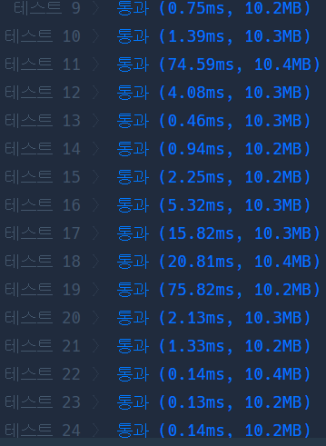
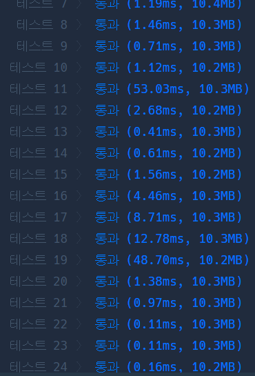

# Python 

## pro level3 경주로 건설

https://programmers.co.kr/learn/courses/30/lessons/67259

> 


* 문제

  > 

* 입력

  > 
  >
  > ```bash
  > 
  > ```
  
* 출력

  > 
  >
  > ```bash
  > 
  > ```
  
  

```python
# from collections import deque
# from heapq import heappush, heappop

# dr = (0, 1, 0, -1)
# dc = (1, 0, -1, 0)


# def solution(board):
#     answer = 0
#     heap = []
#     heappush(heap, [0, 0, 0, []])
#     endrc = len(board)
#     costarr = [[float('inf')] * endrc for _ in range(endrc)]
#     costarr[0][0] = 0

#     while heap:
#         cost, r, c, tmproad = heappop(heap)
#         road = tmproad[:]
#         road.append([r, c])

#         if r == endrc - 1 and c == endrc - 1:
#             answer = cost
#             break

#         for i in range(4):
#             nr, nc, tmpcost, ttroad = r + dr[i], c + dc[i], cost, road[:]
#             if 0 <= nr < endrc and 0 <= nc < endrc and \
#                     not board[nr][nc]:
#                 if len(road) == 2:
#                     if nr != road[0][0] and nc != road[0][1]:
#                         tmpcost += 600
#                     else:
#                         tmpcost += 100
#                     ttroad.pop(0)
#                 else:
#                     tmpcost += 100
                
#                 if tmpcost <= costarr[nr][nc]:
#                     heappush(heap, [tmpcost, nr, nc, ttroad])
#                     costarr[nr][nc] = tmpcost

#     print(costarr)

#     return answer

from collections import deque

dr = (0, 1, 0, -1)
dc = (1, 0, -1, 0)


def solution(board):
    answer = 0
    heap = deque([[0, 0, 0, []]])
    endrc = len(board)
    costarr = [[float('inf')] * endrc for _ in range(endrc)]
    costarr[0][0] = 0

    while heap:
        cost, r, c, tmproad = heap.popleft()
        road = tmproad[:]
        road.append([r, c])

        if r == endrc - 1 and c == endrc - 1:
            answer = cost

        for i in range(4):
            nr, nc, tmpcost, ttroad = r + dr[i], c + dc[i], cost, road[:]
            if 0 <= nr < endrc and 0 <= nc < endrc and \
                    not board[nr][nc]:
                if len(road) == 2:
                    if nr != road[0][0] and nc != road[0][1]:
                        tmpcost += 500
                    ttroad.pop(0)
                tmpcost += 100
                
                if tmpcost <= costarr[nr][nc]:
                    heap.append([tmpcost, nr, nc, ttroad])
                    costarr[nr][nc] = tmpcost

    return answer
```

>heapq를 쓰고 목적지를 만날 때 바로 break를 걸었는데 계속 두 테케를 틀렸었다. 결론적으로는 계속 작은 경로만 먼저 방문하다 보니 틀린 것 같아서 bfs로 바꿨는데 바로 통과.
>
>아 그리고 하나 더.. 나는 리스트를 deque에 넣고 그걸 조작했는데.. 그럼 deque에 들어간 것들의 배열들도 다 바뀐다. 왜그런지 모르겠는데.. 파이썬의 특성이라 그런듯? 그래서 [:]를 꼭 써줘야 함.. ㅠㅠㅠㅠ
>
>마지막으로 내가 혼동한 부분은, 꺾으면 100을 추가 안 해줘도 되는 줄 알았는데 그게 아니라 100은 필수로 추가해 주면서 꺾을 때에는 500도 더해 주는 것..


* 모범답안

  

  ```python
  from collections import deque
  
  def solution(board):
      di = [0, 1, 0, -1]
      dj = [1, 0, -1, 0]
      N = len(board)
      visited = [[-1] * N for _ in range(N)]
      Q = deque()
      Q.append([0, 0, 0, 0])
      Q.append([0, 0, 0, 1])
      visited[0][0] = 0
      while Q:
          now_cost, i, j, d = Q.popleft()
          for k in range(4):
              ni = i + di[k]
              nj = j + dj[k]
  
              # 경계체크
              if ni < 0 or nj < 0 or ni >= N or nj >= N:
                  continue
              # 벽체크
              if board[ni][nj] == 1:
                  continue
              # 뒤로가기 체크
              if abs(k-d) == 2:
                  continue
              cost = 100 if k == d else 600
              new_cost = now_cost + cost
              if visited[ni][nj] == -1 or new_cost <= visited[ni][nj]:
                  visited[ni][nj] = new_cost
                  Q.append([new_cost, ni, nj, k]) 
  
      return visited[N-1][N-1]
  ```
  
  > 뭔데 나보다 훨씬 빠르다. 내생각에 d를 0과 1로 표현했기 때문인듯. 아 알겠다. 대단하네.
  >
  > k-d 절대값이 2이면 뒤로 향하는 거니까 그 과정은 continue로 없애고, 만약 방향이 달라졌다 싶으면 600을 넣는구나 흠흠

