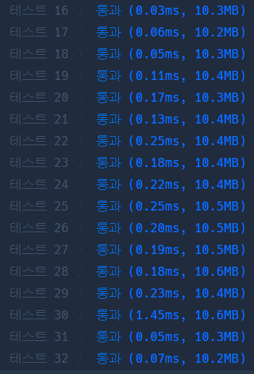

# Python 

## pro level3 배달

https://programmers.co.kr/learn/courses/30/lessons/12978

> 


* 문제

  > 

* 입력

  > 
  >
  > ```bash
  > 
  > ```
  
* 출력

  > 
  >
  > ```bash
  > 
  > ```
  
  

```python
from heapq import heappush, heappop

def solution(N, road, K):
    # K 이하의 거리를 가진 마을을 저장하는 answer
    answer = set()
    
    # 1에서 각 마을의 거리를 저장
    dist = [float('inf')] * (N+1)
    
    # 하나의 마을에서 갈 수 있는 마을과 거리 (ex: [(마을), (거리)]), 우선순위 큐
    arr, heap = [[] for _ in range(N+1)], []
    
    # 1에서 1까지의 거리는 0, 정답에 1도 포함.
    dist[1] = 0; answer.add(1)
    
    # 출발지, 도착지, 거리를 for문으로 돌려 가며
    for r in road:
        s, e, d = r
        
        # K이하의 거리를 가진 두 마을은.
        if d <= K:
            
            # 양방향
            arr[s].append([e, d])
            arr[e].append([s, d])
            
            # 만약 출발지가 1이고, (1 -> 마을)이 기록된 거리보다 가깝다면.
            if s == 1 and d < dist[e]:
                dist[e] = d
                heappush(heap, [d, e])
                answer.add(e)
            if e == 1 and d < dist[s]:
                dist[s] = d
                heappush(heap, [d, s])
                answer.add(s)
            
    # 우선순위 큐에 원소가 존재하는 동안에,
    while heap:
        d, e = heappop(heap)
        if dist[e] < d:
            continue
        
        # 1에서 현재 마을까지 가는 거리가 더 가까운 게 존재하고, 그 거리가 K이하라면.
        # 우선순위 큐에 넣어줌.
        for node, wt in arr[e]:
            if d + wt < dist[node] and d + wt <= K:
                dist[node] = d + wt
                heappush(heap, [d + wt, node])
                answer.add(node)
    
    # K 이하의 거리를 가진 마을의 개수 출력.
    return len(answer)
```

>분명 road에 [4, 1, 2] 처럼! 1이 1번째 인덱스에 주어질 수도 있는 거였는데, 계속 방심하고 e==1일때의 if문을 추가해 주지 않았다. 바보바봉


* 모범답안

  

  ```python
  import sys
  def solution(N, road, K):
      visited, D, r = [False]*(N+1), [sys.maxsize]*(N+1), [[(None, None)]] + [[] for _ in range(N)]
      for e in road:
          r[e[0]].append((e[1],e[2]))
          r[e[1]].append((e[0],e[2]))
      D[1] = 0
      for _ in range(1,N+1): 
          min_ = sys.maxsize
          
          for i in range(1,N+1): 
              if not visited[i] and D[i] < min_:
                  min_ = D[i]
                  m = i
          visited[m] = True
          for w, wt in r[m]:
              if D[m] + wt < D[w]:
                  D[w] = D[m] + wt
  
      return len([d for d in D if d <= K])
  ```
  
  > 너무 오래 걸리는 풀이라 따로 시간은 안넣겠음.
  >
  > sys.maxsize.는 최대로 큰 숫자.
  >
  > 방문표시를 만들고, for문을 돌려가면서 풀었다는 게 신기하다.

